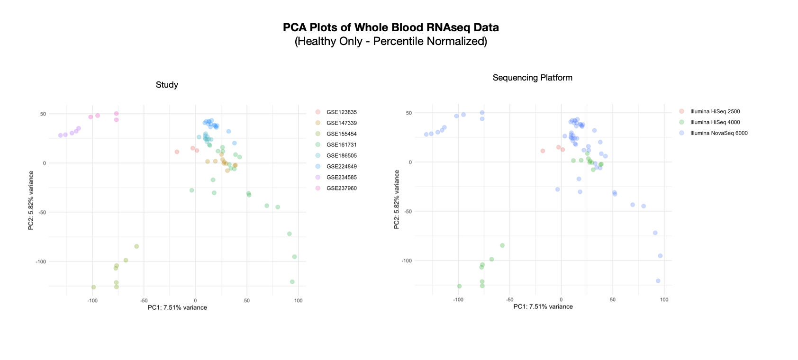

# RNAseq Variation Analysis
Exploring variance in RNAseq data from GEO across multiple studies and platforms.

In this project, I set out to explore the variance in RNAseq data from different studies in the Gene Expression Omnibus (GEO), focusing on whole blood samples. My curiosity was driven by a desire to see how much study-specific factors and sequencing platforms influenced the data and whether different normalization methods could help reduce this variability. By processing data from 575 samples across 10 studies, I wanted to see if I could bring similar samples, like healthy controls, closer together in the analysis. The results showed that even with a few normalization attempts, the data still clustered primarily by study and platform, offering some interesting insights into the challenges of combining RNAseq data from multiple sources.

## Data
To download and process expression data for this analysis, I used my `ena_rnaseq_quantification` tool (https://github.com/hansen-han/ena_rnaseq_quantification) and ran the following commmand:

```run_pipeline.py PRJNA433853 PRJNA510012 PRJNA587698 PRJNA613909 PRJNA649786 PRJNA679264 PRJNA774204 PRJNA932798 PRJNA982094 PRJNA997301```

All data processing and analysis can be found in `analysis.Rmd`. 

## Findings
### Data
I looked at a total of 575 samples from 10 studies in GEO (GSE110487, GSE123835, GSE139940, GSE147339, GSE155454, GSE161731, GSE186505, GSE224849, GSE234585, GSE237960). I only looked at studies which had measured whole blood bulk RNAseq data from one of the following platforms (Illumina HiSeq 2500, IlluminaHiSeq 3000, Illumina HiSeq 4000, and Illumina NovaSeq 6000). To try and minimize potential sources of variance, I quantified all samples from their FASTQ files using Salmon. 

The samples across all studies were collected from a variety of patients with different conditions (psoriasis, influenza, COVID-19, Zika virus, pregnancy, etc.). Eight of the 10 studies had healthy controls. 

### Results
Given the variety of studies, sequencing platforms, and sample types present, I expected to see batch effects. However, I was curious to see if any normalization techniques could help reduce these. Mainly, I was curious to see if any would bring the "healthy controls" together in PCA plots, since you might naturally expect patients with conditions to cluster apart from healthy controls. 

The first method I tried was percentile normalization, where for a given sample, I would assign each gene a value from 0.1 to 0.9 in 0.1 increments depending on its percentile rank within that sample. A gene with TPM in the highest 90th percentile for that given sample would recieve a 0.9, a gene in the 80th percentile would recieve a 0.8, etc. I figured this could help possibly reduce the variance within studies. 

The other method I was curious about trying was "ratio" normalization, for lack of a better term, where I would take a gene with non-zero expression and divide all other genes within a sample by it, using that gene as a reference. 

When I plotted all of these in PCA plots, I observed that samples mainly were grouped by study, then by sequencing platform. Even when looking at sample source, healthy controls were grouped by the study they belonged to instead of grouping together. Even when looking at only healthy control samples (n=80) and omitting all other sample types, you still see strong batch effects by study/platform.




